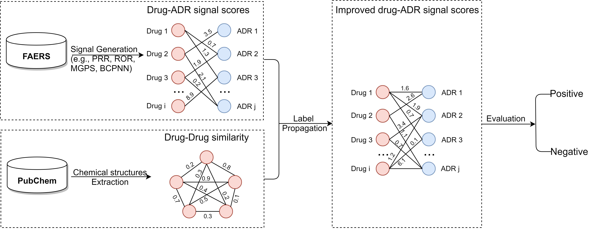

# LP-SDA

## 1. Introduction
This repository contains source code for paper ["Towards early detection of adverse drugreactions: combining pre-clinical drug structuresand post-market safety reports"]() (accepted by **_BMC Medical Informatics andDecision Making_**). 
In this paper, we propose a label propagation framework to enhance drug safety signals by combining pre-clinical drug chemical structures with post-marketing safety reports from [FDA Adverse Event Reporting System (FAERS)](https://open.fda.gov/data/faers/). 

We apply the label propagation framework to four popular signal detection algorithms (PRR, ROR,MGPS, BCPNN) and find that our proposed framework generates more accurate drug safety signals than the corresponding baselines.

## 2. Pipeline


Fig. 1: The overall framework for label propagation based signal detection algorithms. It consists of three main steps: computing original drug safety signals from FAERS reports, constructing a drug-drug similarity network from pre-clinical drug structures, and generating enhanced drug safety signals through a label propagation process.

## 3. Dataset
Datasets used in the paper:
- [FAERS](https://open.fda.gov/data/faers/): a database that contains information on adverse event and medication error reports submitted to FDA. We use a curated and standardized version of FAERS data from 2004 to 2014 (Banda, Juan M. et al., 2017) [[paper&data]](https://datadryad.org/stash/dataset/doi:10.5061/dryad.8q0s4).
- [PubChem](https://www.ncbi.nlm.nih.gov/pubmed/26400175): a public repository for information on chemical substances and their biological activities. The PubChem Compound database provides  unique chemical structure information of drugs.
- [SIDER](http://sideeffects.embl.de/): a database that contains information on marketed medicines and their recorded adverse drug reactions. 

## 4. Code
#### Running example
```
python run.py --input SignalScoresSource --method PRR05 --year all --eval_metrics all --split True
```

#### Parameters
- --input, input original signal scores files. 
- --method, signal detection algorithm (i.e., PRR, ROR, MGPS, BCPNN).
- --year, years of data used for model (i.e., all years data from 2004 to 2014 or data arranged by ending years).
- --eval_metrics, evaluation metrics (i.e., AUC, AUPR, Precision, Recall, etc.)
- --split, whether to split entire dataset into validation set and testing set.
- --output, output file.

## 5. Citation
Please kindly cite the paper if you use the code, datasets or any results in this repo or in the paper:
